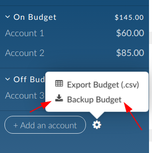

# Financier to Actual Budget Importer - Enhanced

### What does this tool do?

This is an enhanced tool to help migrate from [Financier](https://financier.io/) to [Actual Budget](https://actualbudget.org/). It imports your complete Financier budget including accounts, categories, payees, transactions, and budget amounts.

It makes use of the Actual Budget API and requires Node.js to be installed.

### Enhanced Features

This version includes support for:

1. **Flag Preservation** - Financier flags are converted to color names and added to transaction notes as "[Color Flag] original note"
2. **Income for Next Month Documentation** - Creates a detailed report documenting which income was originally marked for next month in Financier
3. **Carryover Categories** - Categories marked with overspending carryover in Financier will have the carryover flag set in Actual Budget

### What gets imported?

- ✅ **Accounts** - All account types with proper mapping
- ✅ **Category Groups & Categories** - Complete category structure  
- ✅ **Payees** - All payees with suggestions
- ✅ **Transactions** - All transactions with notes, flags, and splits
- ✅ **Budget Amounts** - Monthly budget allocations
- ✅ **Carryover Settings** - Overspending carryover preferences
- 📝 **Income Next Month** - Documented for reference (imported as regular income)

As with anything you find on the internet, use at your own risk. Standard disclaimers apply.

### Prerequisites

- [Node.js](https://nodejs.org/en) (v18 or higher recommended)
- [npm](https://www.npmjs.com/) (comes with Node.js)
- An Actual Budget server running and accessible
- Server password for your Actual Budget instance

### Installation

1. **Export your Financier budget** in JSON format:



2. **Clone or download this repository**:

```sh
git clone https://github.com/jat255/financier-to-actual.git
cd financier-to-actual
```

3. **Install dependencies**:

```sh
npm install
```

### Usage

You can run the importer using either command line arguments or environment variables.

#### Method 1: Command Line Arguments

```sh
node ./financier-to-actual --url https://your.actual.server.com --password "your_password" --json "My Budget Export.json"
```

#### Method 2: Environment Variables

Create a `.env` file in the project directory:

```env
ACTUAL_URL=https://your.actual.server.com
ACTUAL_PASSWORD=your_password
FINANCIER_JSON=My Budget Export.json
```

Then run:

```sh
node ./financier-to-actual
```

#### Method 3: Mixed Approach

```sh
ACTUAL_URL="https://your.server.com" node ./financier-to-actual --json "My Budget.json"
```

### What Happens During Import

The importer will:

1. **Connect to your Actual Budget server**
2. **Create a new budget** with your Financier budget's name
3. **Import all data** in the following order:
   - Accounts
   - Category groups and categories  
   - Payees
   - Transactions (with flag preservation)
   - Budget amounts and carryover settings
   - Generate documentation for income marked for next month

4. **Generate reports** showing what was imported and any special handling

After completion, you'll find your imported budget in Actual Budget, ready to use!

### Example Output

Here's what a typical import looks like:

```
$ node financier-to-actual --json "My Budget Export.json"

Using the following settings:
         ACTUAL_URL: https://your.server.com (source: environment)
    ACTUAL_PASSWORD: ******************* (source: environment)
     FINANCIER_JSON: My Budget Export.json (source: cli)

Initializing API client
Running actual import
Loading fresh spreadsheet
(Step 1/8) adding accounts to budget
 ████████████████████████████████████████ 100% | ETA: 0s | 28/28
(Step 2/8) adding category groups
 ████████████████████████████████████████ 100% | ETA: 0s | 14/14
(Step 3/8) adding categories
 ████████████████████████████████████████ 100% | ETA: 0s | 134/134
(Step 4/8) adding payees
 ████████████████████████████████████████ 100% | ETA: 0s | 1243/1243
(Step 5/8) adding transactions
 ████████████████████████████████████████ 100% | ETA: 0s | 11061/11061
(Step 6/8) documenting income marked for next month
Found income for next month in 107 month(s) - documenting for reference
(Step 7/8) processing budget amounts
 ████████████████████████████████████████ 100% | ETA: 0s | 5861/5861
(Step 8/8) generating income-for-next-month documentation

Income-for-next-month documentation generated: income_next_month_documentation_2025-08-31.md

=== Income Originally Marked for Next Month ===
📊 Found 107 months with income marked for next month
💰 Total amount: $565,432.10
📝 All income imported as regular income - see report for details

✅ Import completed successfully!
```

### Post-Import: What to Review

After a successful import:

1. **📄 Review the documentation report** - Check `income_next_month_documentation_YYYY-MM-DD.md` for details about income that was originally marked for next month
2. **🏷️ Verify flags** - Look for transactions with `[Color Flag]` prefixes in their notes  
3. **📊 Check carryover settings** - Ensure categories have the correct overspending rollover behavior
4. **💰 Validate budget amounts** - Compare totals with your Financier budget to ensure accuracy
5. **🔄 Optional month-ahead setup** - If desired, use Actual Budget's "Hold for next month" feature going forward

### Income for Next Month Handling

This enhanced version takes a **simplified documentation approach** to "Income for Next Month":

- ✅ **All income imported as regular income** - Available immediately when received
- 📝 **Comprehensive documentation** - Detailed report shows which income was originally marked for next month
- 🎯 **No complex monthly tasks** - No ongoing transfers or category management required
- 💡 **Optional manual adjustments** - Use Actual Budget's hold feature if you want to recreate month-ahead budgeting

### Flag Preservation Details

**Supported Flag Colors:**
- 🔴 Red - `[Red Flag]`
- 🔵 Blue - `[Blue Flag]`  
- 🟢 Green - `[Green Flag]`
- 🟡 Yellow - `[Yellow Flag]`
- 🟠 Orange - `[Orange Flag]`
- 🟣 Purple - `[Purple Flag]`
- 🎨 Unknown colors - `[Colored Flag]`

**Examples:**
- Original: Red flag + "Rent payment" → Imported: "[Red Flag] Rent payment"
- Original: Blue flag + no memo → Imported: "[Blue Flag]"

### Troubleshooting

**Common Issues:**

- **"Categories skipped"** - Some categories may have undefined parent groups and will be skipped with warnings
- **Missing flags** - Ensure your Financier export includes transaction flags as hex color codes
- **Carryover differences** - Actual Budget's carryover may behave slightly differently than Financier's

**Getting Help:**

If you encounter issues, please create an issue on this repository with:
- Your Node.js version (`node --version`)
- Error messages or unexpected output
- Anonymized sample of your Financier JSON (if relevant)

### Dependencies

This tool uses:
- `@actual-app/api` ^25.8.0 - Actual Budget API client
- `commander` - Command-line interface
- `cli-progress` - Progress bars during import
- `dotenv` - Environment variable support